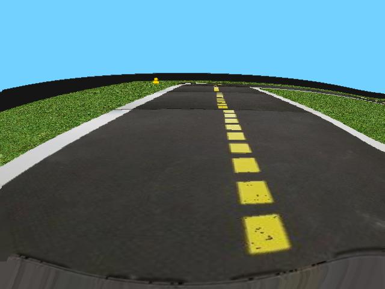

# DuckPropagation
In this project we are training Deep Reinforcement Learning agents to drive small robots called Duckiebots in the Duckietown environment. There are four challenges in the environment:

- **LF** - simple lane following
- **LFV** - lane following with vehicles
- **LFI** - lane following with intersections
- **LFVI** - lane following with vehicles and intersections

In order to conquer these challenges, autonomous driving agents are first trained in a simulator (gym-duckietown) and then the trained agents performance will also be tested in the real environment on real Duckiebots.

:tv: The **presentation video** for this work can be found [here.](https://www.youtube.com/watch?v=kkLZT__tk4c)


## Authors
Team DuckPropagation:
- Attila Pethő
- Gyula Faragó
- Olivér Farkas


## Installation

### Setup using conda

**Requirements**: `git` and `conda` installed on your computer

Clone the repository:
```bash
git clone https://github.com/attila-petho/DuckPropagation.git
cd DuckPropagation/
```

Run environment setup script:
```bash
bash env_setup.sh
```

### Setup using docker

To build the docker image, run this from the root directory:
```bash
sudo docker build . -t attilap/duckpropagation:dtgym
```

Duckietown uses a very verbose logging by default, to make it a bit less overwhelming use this command in the running container:
```bash
echo "logger.setLevel('WARNING')" >> ./gym-duckietown/src/gym_duckietown/__init__.py
```

## Usage
Before running the scripts in this repo, make sure that the ```dtgym``` anaconda virtual environment is activated using
```bash
conda activate dtgym
```

#### Training:
To train an A2C or PPO agent, first open the ```config/train_config.yml``` file and edit the *common_config* and *ppo_only* or *a2c_only* sections. You can choose the algorithm you want to use, its hyperparameters and the parameters of the training. Then run the training code for the chosen algorithm:
```bash
python3 src/train_PPO.py
```
or
```bash
python3 src/train_A2C.py
```

#### Hyperparameter optimization:
To optimize an A2C or PPO agent, run the optimization code for the chosen algorithm:
```bash
python3 src/optimize_PPO.py
```
or
```bash
python3 src/optimize_A2C.py
```

#### Evaluation:
The trained agent's performance can be evaluated using the ```test_agent.py``` file. Before running the scipt make sure that the *eval_config* section of the ```config/train_config.yml``` is set to your needs. Note that the other sections of the config file must be set according to the model you would like to load. (Right now you can choose from the *base* and *optimized* versions of PPO and A2C, to load the right version set these variables in the config file:)

```algo:``` PPO *or* A2C\
```steps:``` 2e6 (for optimized) *or* 1e6 (for base)\
```color_segment:``` False\
```FS:``` 3\
```domain_rand:``` 1\
```action_wrapper:``` heading\
```ID:``` optimized *or* base

## Preprocessing
The simulator produces 640x480 RBG images that look like this:



The first step is to preprocess these images for the CNN. This step is necessary because feeding the original images makes the training process much slower and it would also be a waste of resources because the network can learn from much smaller images just as well. So for the optimal learning process we do the following steps:

**1. Resizing**

**2. Cropping**

**3. Color segmentation or Grayscaling**

**4. Normalization**

**5. Frame stacking** 

These preprocessing steps require the use of so-called wrappers, which basically wrap around the enviroment, take the observations and convert them according to their purpose. We created the following wrappers for these tasks:

#### ResizeFrame
With this wrapper we are downscaling the images from their original size (480x640x3) to (84x84x3). The smaller dimension makes the training of the neural network faster, and it still carries enough information for efficient training.

#### CropFrame
In this wrapper we are cropping the useless information from the image, in our case it's the part above the horizon.

#### GrayScaleFrame
Training time can be reduced by using grayscale images instead of RGB, while keeping the important information of the images. This wrapper should not be used in conjunction with the ColorSegmentFrame wrapper.

#### ColorSegmentFrame
Here we are segmenting the different parts of the image so we can feed the neural network more useful information. The segmentation is done using intervals, we assigned the red channel for the white line, and the green channel for the yellow line. For lane following only these two information are useful for the neural network, so we assign black for everything else.

#### NormalizeFrame
To make the training of the CNN easier and faster this wrapper normalizes the pixel values in the interval of [0,1]. Altough we implemented this wrapper, it is not used, because stable baselines does the input normalization automatically.

#### StackFrame
For better quality in training and more information we are concatenating the last **n frames** to form a time series, so the agent can percieve dynamic changes in its environment.

## Actions
The Duckiebots are two-wheel differential-drive vehicles, and the default actions in the simulator are interpreted as a list of the left and the right wheel angular velocities, where 1 and -1 correspond to the maximum angular velocities forward and backward. This continuous action space has left and right velocity pairs that are not particularly useful (e.g. low velocities), so we experimented with two new action representations.

**Wheel velocity - braking<sup>1</sup>:** Since negative velocities are not required for moving forward, these are clipped, and the predicted values are interpreted as the amount of braking from full speed at each wheel. This creates a bias for moving forward at full speed.

**Steering<sup>1</sup>:**  Instead of predicting a vector containing the two wheel velocities, the agent predicts a scalar value between -1 and 1, where 0.0 represents going forward at full speed, and -1 and 1 correspond to turning left or right with one wheel completely stopped and the other spinning at maximum speed. Intermediate actions are continuously mapped to wheel velocities using linear interpolation. In this case the speed is always maximal for a given steering value.

## Rewards
Reward shaping is essential in RL, since this is the basis for the agent's learning. Without a good reward function the agent will maximize its score, but won't learn the intended behaviour. The goal of the robot should be to move forward in the right lane as fast as possible. To encourage this behaviour we used a reward fuction<sup>1</sup> that considers both the orientation and the velocity of the Duckiebot. The orientation reward is based on the lateral position of the robot, so it should always face towards the center of the right lane, while the velocity reward is given based on the fastest moving wheel to encourage high velocity in both straight and curved sections.

## Training
For the training we used the *Stable Baselines 3* library, which contains several implementations of state-of-the-art RL algorithms. We used **A2C** and **PPO** agents with mostly default settings and 0.0005 learning rate for 1 million steps on the _'zigzag_dists'_ maps. The algorithm hyperparameters that were used for the first trainings are shown in the table below. The trained models and the tensorboard logs of the first trainings can be found in the corresponding folders. The next step will be to optimize the agents' hyperparameters using an optimization library.

|Hyperparameter | A2C, PPO  | 
| ------------- |:---------:|
| Learning Rate | 0.0005    |
| Stacked Frames| 3         |
| Actions       | steering  |

## Evaluation
To evaluate the agents' performance two metrics were used: _Survival time_ (measured in timesteps), and the _Reward_ received from the environment. _Survival time_ is the number of steps that the agent took in the environment until it left the road. A well-trained agent should be able to stay on the road for the whole evaluation period. _Reward_ is the default reward given by the environment, based on the robot's orientation and letaral position.

The trained agents will also be submitted to the AIDO lane following challenge to compare their performance with other contestants. In addition the trained agents will be tested in a real environment using Duckiebots.

## File Structure

|File or folder name | Description  | 
| ------------- |---------|
| `src/`                            | The source folder. |
| `src/images/`                     | Output samples of the wrappers and GIFs are stored here. |
| `src/utils/`                      | Contains the environment and system utilities. |
| `src/tensorboard/`                | Tensorboard logs folder. |
| `src/test1.py`                    | Test script used for checking the wrappers. |
| `src/train_A2C.py`                | Training script for the A2C agent. |
| `src/train_PPO.py`                | Training script for the PPO agent. |
| `src/optimize_A2C.py`             | Hyperparameter optimization script for the A2C agent. |
| `src/optimize_PPO.py`             | Hyperparameter optimization script for the PPO agent. |
| `src/test_agent.py`               | Test script for evaluating the agent's performance. |
| `models/`                         | Save location for the trained models. |
| `logs/`                           | SB3 and training logs folder. |
| `duckietowndoc/duckietowndoc.pdf` | Document for the project. |
| `DuckPropagation_presentation.pptx` | Presentation slides.  |

## References
1. András Kalapos, Csaba Gór, Róbert Moni and István Harmati. "Sim-to-real reinforcement learning applied to end-to-end vehicle control" arXiv:2012.07461
(2020) (https://github.com/kaland313/Duckietown-RL)